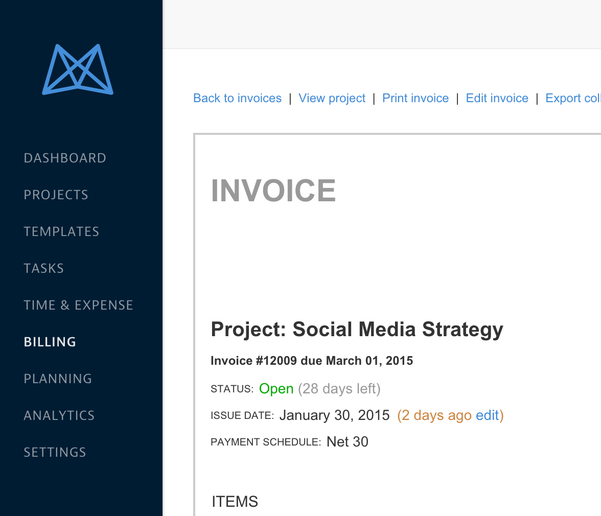
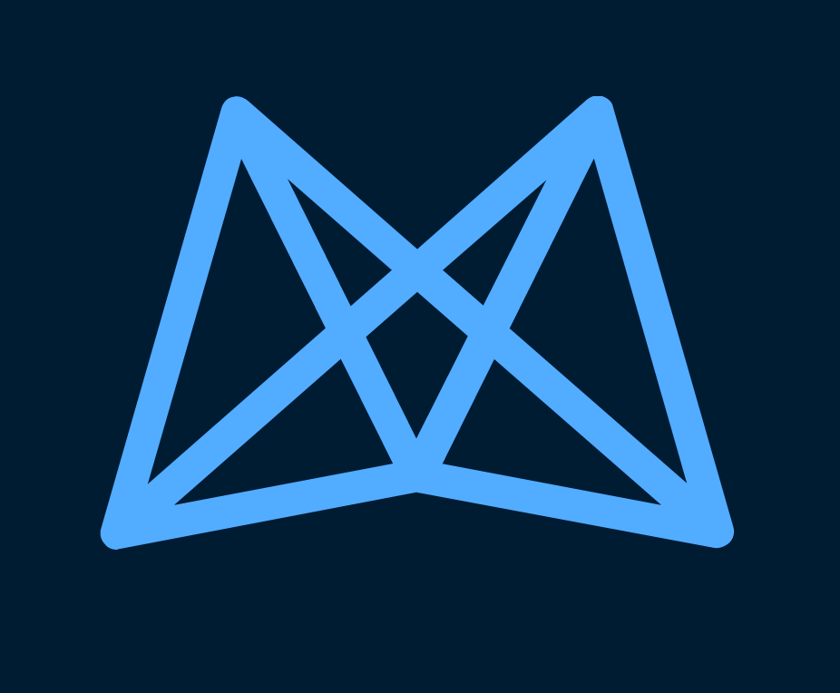
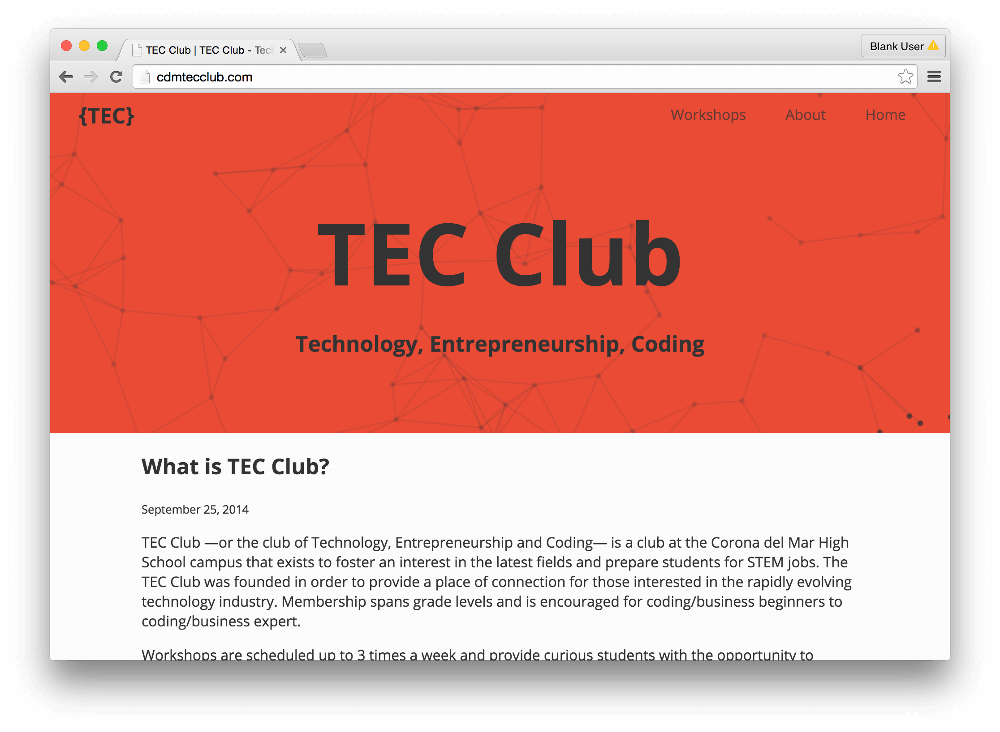

I just did a minor revamp of the TEC Club homepage in order to include a live, JS generated network of floating dots. Opaque interconnections will pop to life when the dots travel within 100 pixels of each other. On mouse over, the connections will fade away and the dots will grow increase in opacity. It can be quite entertaining to watch. I enjoy playing [this](http://s.codepen.io/awendland/debug/XJExGv?) version in full screen and just watching it.

I was inspired by the new [Mavenlink](http://mavenlink.com) brand refresh, the dashboard of which I have placed an image of here:

<!--break-->

I was inspired by the logo in particular:

This reminded me of the networked-dot charts that I seen before (most recently in Good Will Hunting as the second problem that Will Hunting solved). Simple canvas particle animations are relatively simple, so I decided to spend a little bit of time whipping something together.

The codepen demo that follows is substantially more performant than v1, after spending an optimization period on it I was able to reduce frame draw time by roughly 60%. This was mostly in part to switching from using [MDN: array.some()](https://developer.mozilla.org/en-US/docs/Web/JavaScript/Reference/Global_Objects/Array/some) and instead using [MDN: for loops](https://developer.mozilla.org/en-US/docs/Web/JavaScript/Reference/Statements/for). It's too bad that the convenient syntax provided by basic [MDN: array](https://developer.mozilla.org/en-US/docs/Web/JavaScript/Reference/Global_Objects/Array) methods.

See the Pen <a href='http://codepen.io/awendland/pen/XJExGv/'>XJExGv</a> by Alex Wendland (<a href='http://codepen.io/awendland'>@awendland</a>) on <a href='http://codepen.io'>CodePen</a>.

This evolved into an interactive version and eventually the version that can be found on the [TEC Club homepage](http://cdmtecclub.com). Here's a screenshot of the current state of the [TEC Club homepage](http://cdmtecclub.com) to demonstrate a still version of the effect.

You can delve into the [CodePens](http://codepen.io) in order to see the JS, CSS and HTML workings of the effect. I currently (2015-02-20) have three projects related to it:

- Initial Mavenlink creation [http://codepen.io/awendland/pen/XJExGv](http://codepen.io/awendland/pen/XJExGv)
- Performance testing version [http://codepen.io/awendland/pen/wBmLxN](http://codepen.io/awendland/pen/wBmLxN)
- Draft 1 TEC Club animation [http://codepen.io/awendland/pen/wBmLRO](http://codepen.io/awendland/pen/wBmLRO)

The current production code for the animation on the TEC Club website can be found at

- [http://cdmtecclub.com/scripts/network-anim.js](http://cdmtecclub.com/scripts/network-anim.js)
- [http://cdmtecclub.com/styles/network-anim.css](http://cdmtecclub.com/styles/network-anim.css)
